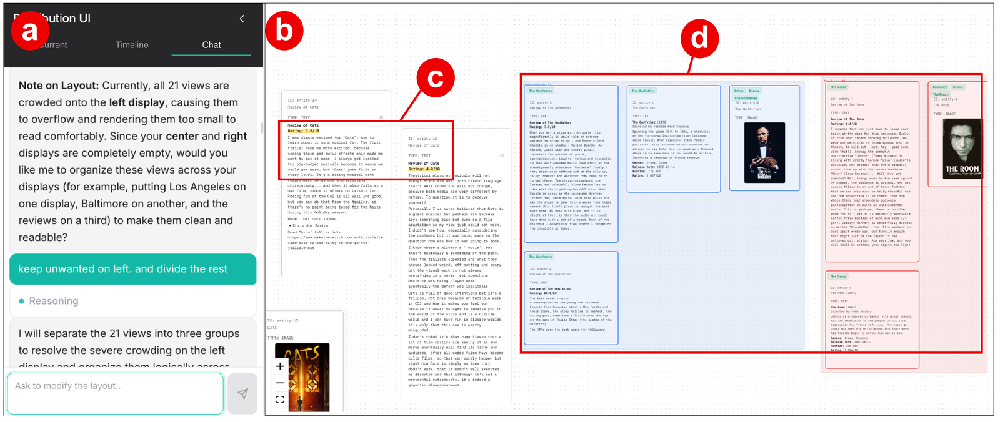
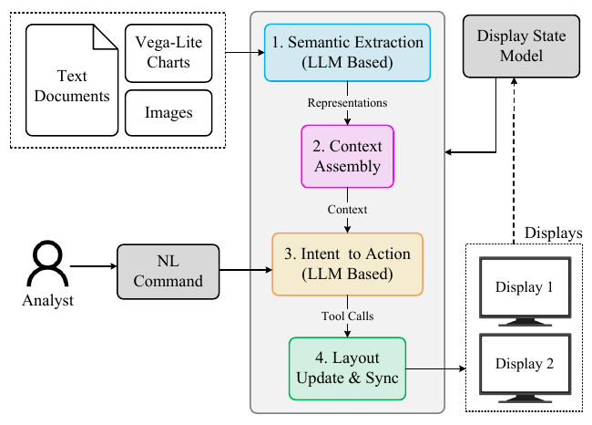
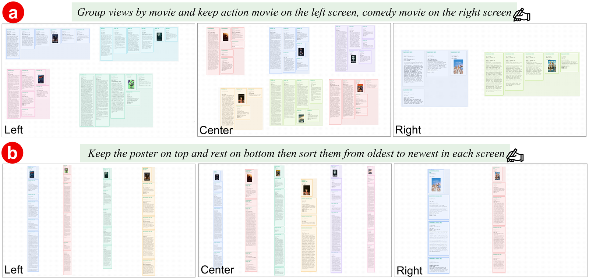
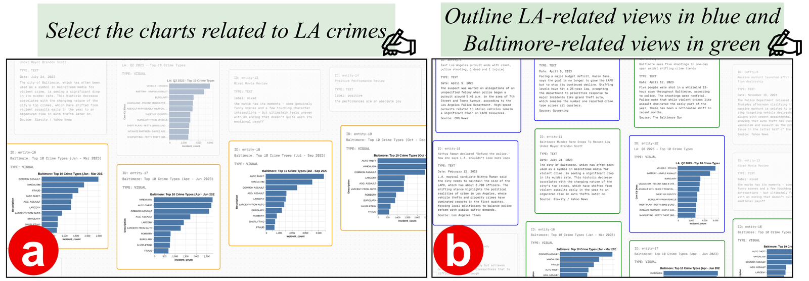
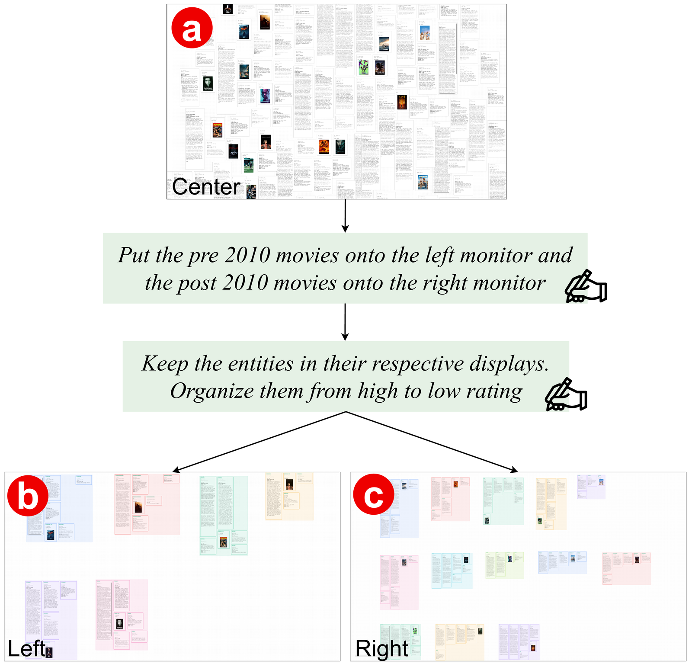
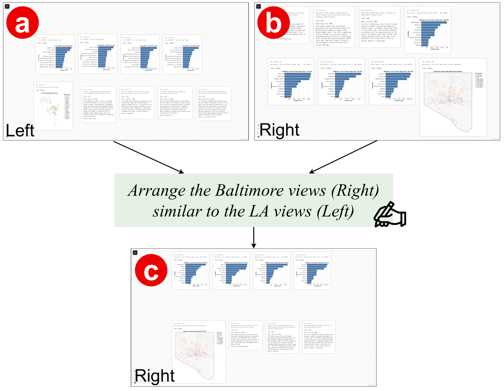

# CanvasChat

Natural-language system for organizing charts, documents, and images across multiple displays. Analysts express intent in freeform language (e.g. "group by sentiment", "put pre-2010 movies on the left display") and an LLM agent translates it into coordinated layout updates — while direct manipulation stays available for fine-grained adjustments.

## System overview



*CanvasChat user interfaces. (a) The chat panel supports natural-language commands and agent responses. (b) The canvas workspace displays views across multiple displays. (c) Highlighted text marks relevant content within individual views. (d) Colored overlays indicate grouped views created during organization.*

## Architecture



*System architecture. Four-stage pipeline: semantic extraction → context assembly → intent-to-action translation → layout update and synchronization. The LLM (Gemini via Google ADK) performs extraction and intent translation; deterministic stages assemble workspace context (view semantics, annotations, display state) and execute layout operations. Canvas: React Flow with WebSocket-based sync across displays.*

## Organize across displays



*Example of CanvasChat's organize interaction across three displays (Left, Center, and Right). Prompts are shown above each panel, and colored bounding boxes indicate movie-based groups. (a) The agent groups views by movie and distributes action and comedy movies across separate displays. (b) A follow-up prompt reorders the groups vertically from oldest to newest while preserving their display assignments.*

## Select by meaning



*Selection interaction. (a) The agent highlights charts related to Los Angeles crime and dims other unrelated views. (b) Color-coded outlines distinguish LA-related and Baltimore-related views.*

## Study examples

### Example 1



*Layout progression. (a) Movie views initially appear on the center display. After separating movies by era and sorting them by rating, CanvasChat places pre-2010 movies on the left display (b) and post-2010 movies on the right display (c), with highlighted views indicating the organized groups.*

### Example 2



*Layout mirroring interaction. (a) Los Angeles views are organized on the left display. (b) Baltimore views appear on the right display before the command. (c) CanvasChat mirrors the Los Angeles structure onto the Baltimore views.*

## Features

- **Entity canvas**: Interactive nodes-only view built with React Flow (@xyflow/react). No edges — spatial layout only.
- **Chat agent**: Ask the LLM to move, add, remove, highlight, or focus entities. Layout changes stream back in real time (SSE) and are applied as deltas.
- **Entities-only mode**: Load entities entirely on the frontend — no backend call, automatic grid distribution.
- **Multi-display sync**: Open the app in multiple browser windows; node positions and UI state sync in real time via Yjs (CRDT over WebSockets).
- **Rich content**: Text entities and interactive charts inside entity panels.
- **Session recording/replay**: rrweb-based recording with a standalone replay page.

## Quick Start

### Backend

```bash
cd backend
uv sync                  # creates .venv and installs deps from pyproject.toml/uv.lock
source .venv/bin/activate
cp .env.example .env     # set LLM_API_KEY, GEMINI_API_KEY and model config
uvicorn main:app --reload  # serves on http://127.0.0.1:8000
```

### Frontend

```bash
cd frontend
npm install
npm run dev        # dev server (port 5174, or 5173 in production mode)
npm run yjs-server # optional: start Yjs websocket server (port 1234)
```

The frontend expects the API at `http://127.0.0.1:8000` by default; override with `VITE_API_BASE_URL`.

## Entities JSON format

Create a JSON file with an `analyzed_entities` array:

```json
{
  "analyzed_entities": [
    {
      "id": "entity-1",
      "name": "Population by Year",
      "type": "text",
      "value": "Population grew from 1.2M to 2.8M between 2000 and 2020."
    }
  ]
}
```

**Required fields per entity**: `id` (or `name`), `type`, `value`

Place your JSON file in `frontend/data/` and load it via the sidebar file picker.

## Architecture details

- **Frontend**: React 18 + TypeScript + Vite
- **Canvas**: @xyflow/react (React Flow)
- **State**: Zustand stores (`frontend/src/stores/`)
- **Real-time sync**: Yjs over WebSockets (`y-websocket`)
- **Charts**: Vega-Lite via react-vega
- **Backend**: Python FastAPI (`backend/`), Gemini models via LLM config

### Coordinate system

All node positions are display-local canvas top-left coordinates end to end (backend → store → React Flow → Yjs). There is no abstract-to-canvas scaling step.

### Chat action flow

The backend agent runs tools that mutate layout state and returns an `action` with a `type` and `layout_delta`. The frontend dispatches these through a handler registry (`frontend/src/components/Chat/actionHandlers/`) — each action type maps to a handler implementing `apply(ctx)`. See `frontend/AGENTS.md` for how to add new action types.

## Development

```bash
cd frontend
npm run dev      # start dev server
npm run build    # typecheck + build
npm run lint     # eslint
```

## Documentation

- [Frontend: API endpoints](frontend/docs/API_ENDPOINTS.md)
- [Frontend: Chat API guide](frontend/docs/CHAT_API_GUIDE.md)
- [Frontend: Coordinate system](frontend/docs/coordinate-system.md)
- [Backend](backend/README.md)

## Repo layout

```
.
├── README.md            # this file
├── assets/paper/        # figures shown above (exported from paper sources)
├── backend/             # FastAPI + LLM agent (see backend/README.md)
├── frontend/            # React + React Flow canvas (see frontend/README.md)
├── docker-compose.yml
└── nginx.conf
```
